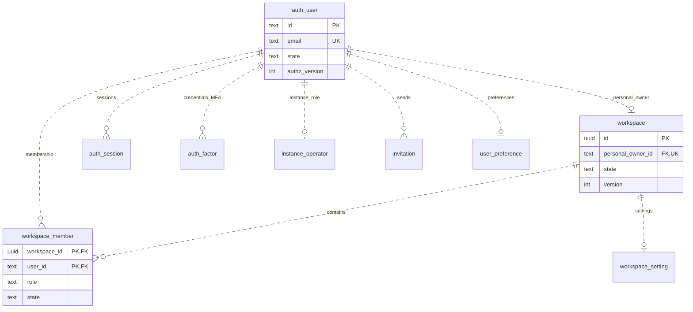
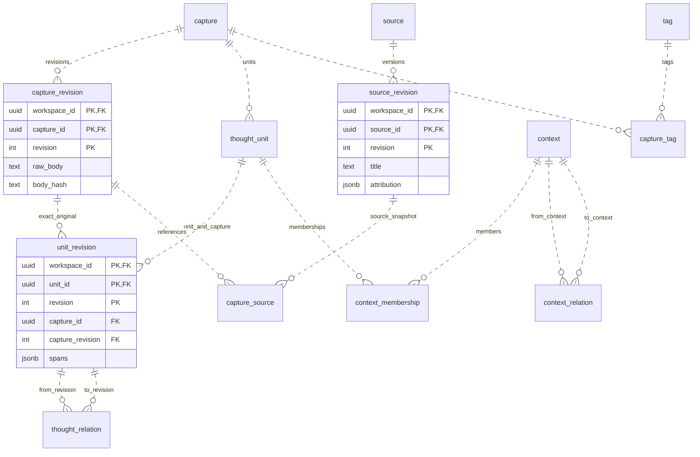
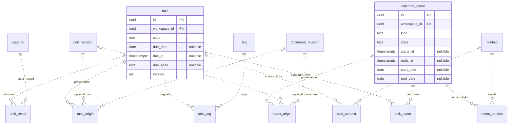
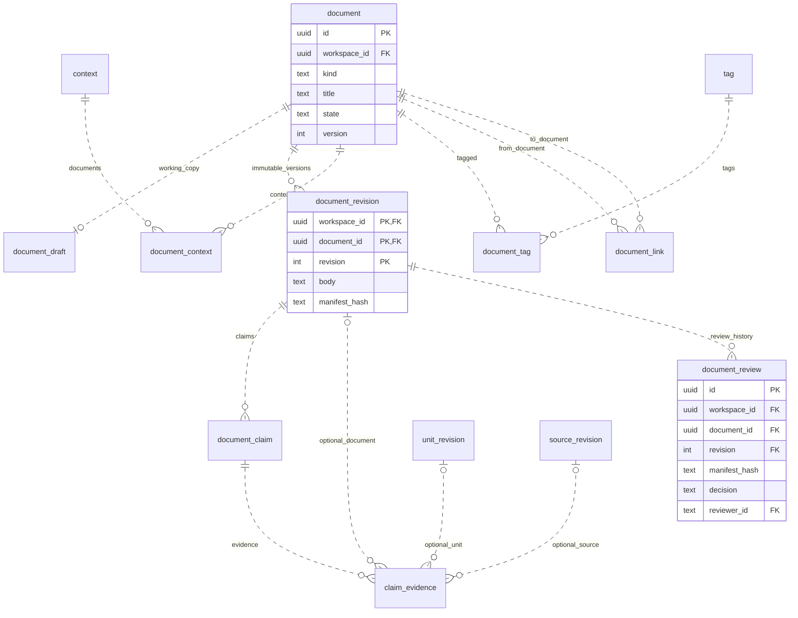
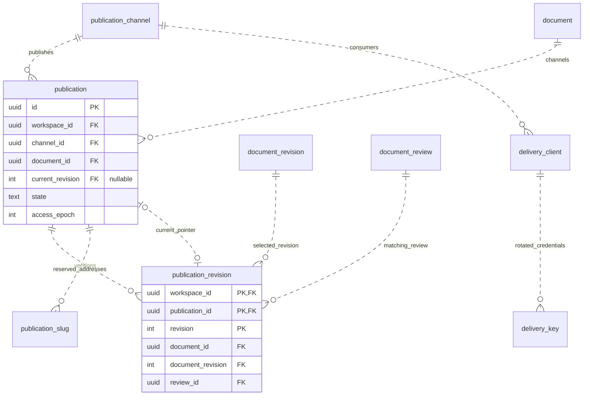
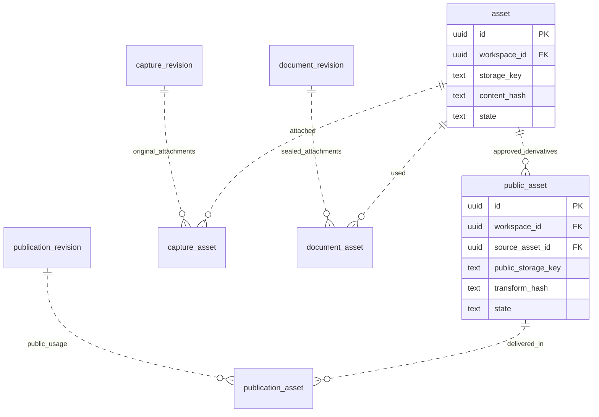
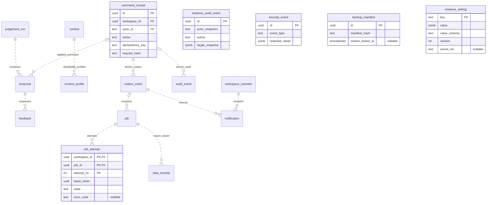

# IEUM · ERD

기준: 2026-09-22. 아래는 저장소에서 바로 읽는 관계 중심 Mermaid 도식이다. 전달 패키지에는 같은 논리 모델의 상세 속성 SVG 7개와 전체 개요, `schema.json`, DBML, 데이터 사전을 포함했다.

66개 엔터티는 단계별 전체 논리 모델이며 실행할 migration 수가 아니다. 인증 관련 도식은 선택한 라이브러리에 매핑할 계약이다. 실제 vendor 테이블을 별도로 중복 구현하지 않는다.

`||`는 정확히 하나, `o|`는 0 또는 1, `o{`는 0 이상을 의미한다. [Mermaid ERD 문법](https://mermaid.js.org/syntax/entityRelationshipDiagram). 영역 밖의 참조 테이블은 설명을 위해 반복 표시한다. 복합 FK의 전체 컬럼과 null 조합은 [schema 계약](schema-contracts.md)이 기준이다.

## 1. 계정 · 개인 공간 · 설정 (F)

초대는 기존 Workspace 공유가 아니다. Owner가 존재하는 상태와 마지막 운영자 보호는 명령·잠금에서 검사한다. 초기에는 OWNER membership만 활성화한다.

## 2. 원본 · 외부자료 · 맥락 (P)

PRIMARY는 active 기준 최대 하나이며 SECONDARY는 여러 개다. source attribution은 외부 저자와 자료 위치이지 회원 소유권이 아니다. 같은 원본 파생 기록의 반복을 독립 근거로 세지 않는다.

## 3. 할일 · 일정 · 결과 (P)

각 origin 행의 Unit/Document target은 정확히 하나다. 직접 작성한 Task/Event는 origin 행이 없어도 된다. 종료일 배타 ALL_DAY와 timezone 있는 TIMED를 동시에 채우지 않는다. 결과 기록은 다시 지식 풀로 들어간다.

## 4. 위키 · 글 · 출처 · 검토 (P/D)

WIKI/ARTICLE/NOTE는 같은 편집·revision 기반을 사용한다. claim_evidence의 대상 세 종류 중 정확히 하나를 요구하며 ID/revision을 한 쌍으로 검증한다. 여러 review 중 과거 READY만 골라 발행하지 못하도록 최신 유효 검토를 잠금 내에서 확인한다.

## 5. 발행 · 주소 · API 키 (R)

Publication과 public revision의 document_id는 일치해야 한다. current pointer는 자기 Publication의 revision만 가리킨다. 채널/slug는 composite unique이며 이전 주소도 예약한다. 키 원문은 저장하지 않고 digest·만료·철회를 key별로 관리한다. 내부 draft/claim mapping을 공개 DTO에 복제하지 않는다.

## 6. private 첨부 · public 파생물 (P/R)

asset 파일 내용을 수정하지 않고 교체 시 새 asset을 만든다. 공개용 사본과 사용처는 별도이며 첨부 URL의 접근 조건도 publication의 공개/철회 상태를 따른다. 원본의 signed URL을 발행 글에 영구 삽입하지 않는다.

## 7. 명령 · 판단 · 작업 · 감사 (F/P)

인스턴스 사건과 개인 감사의 권한 경계는 다르다. application runtime 로그 자체를 모두 관계 DB에 저장해야 하는 것은 아니다. expired attempt가 결과를 쓰지 못하도록 lease/fencing을 검증하고 완료 시점에도 actor·원문 상태를 다시 검사한다.

## 모델 해석의 주의점

관계선의 존재만으로 권한·현재 상태·인용의 진실성이 증명되지는 않는다. 최신 READY, 마지막 Owner, context DAG, publication 공개 상태 등은 일반적인 행 CHECK나 FK만으로 해결하지 않는다. 실제 DB 적용과 동시성 검증은 [구현 계획](../plan/implementation-backlog.md)의 완료 조건이다.
